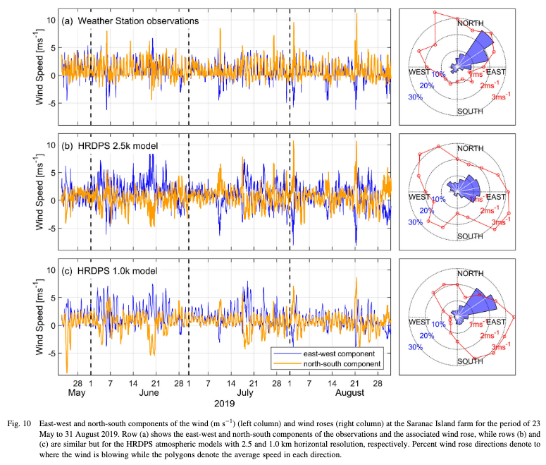
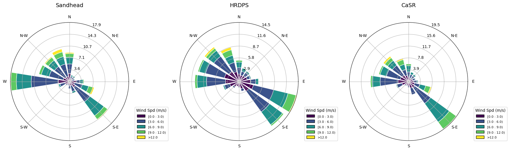
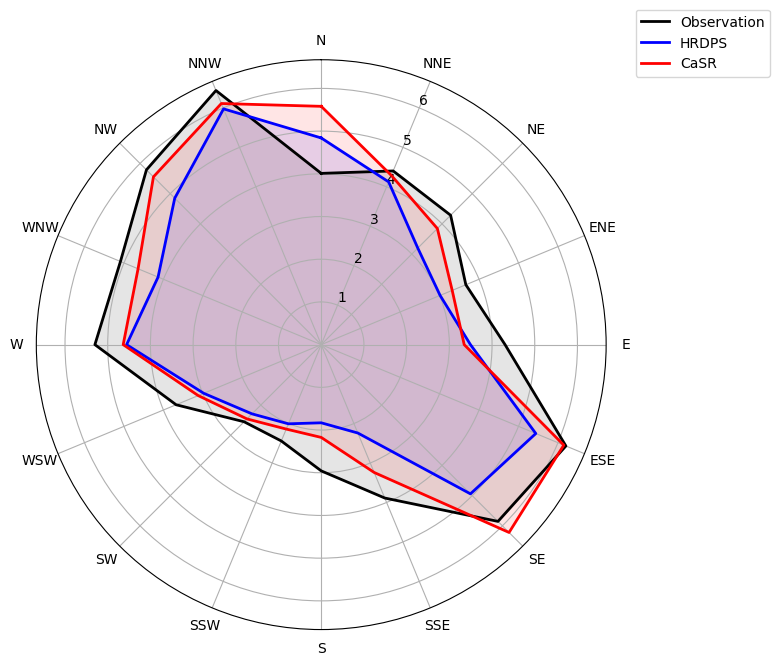
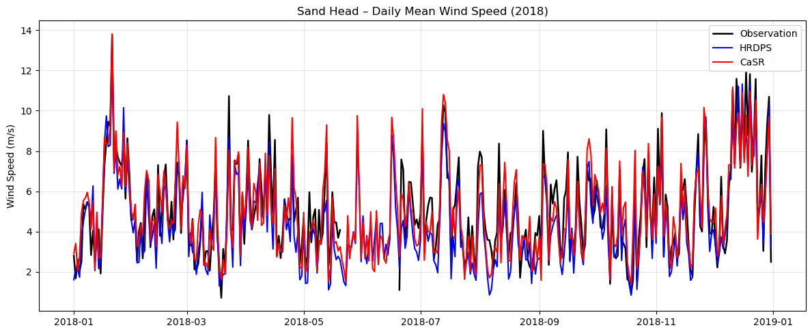
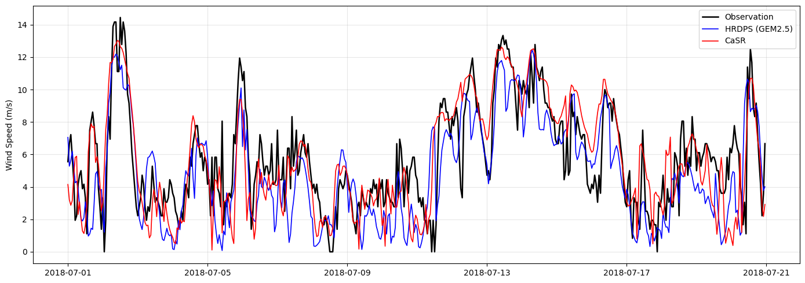

# Weekly Meeting on April.23

## Reading: M.G.G. Foreman et al.

**Findings:**

1. The two components of the observed winds are generally of comparable magnitude, except during a few storm events, the east–west component (blue) for the two model winds generally dominates.

2. While the strong northwestward winds observed on 1–2 August (in 2019) and 21 August were reproduced with the 2.5 km model, they were underestimated by the 1.0 km model.

3. The wind rose for the 1.0 km HRDPS winds has a directional polygon that is close to that observed.

4. Not clear that the average speed polygon (of HRDPS) is any closer to that observed than the 2.5 km model winds.

5. All time series displayed regular daily sea breeze signals that Fast Fourier Transform analyses confirm are in reasonable agreement.

## HRDPS vs CaSR vs Observation

### Data

Sandhead

km/h $\to$ m/s

2018 all year, using UTC

downloaded from https://climate.weather.gc.ca/climate_data/hourly_data_e.html?climate_id=1107010.

HRDPS

The closest grid point was chosen. Lat = 49.1116, Lon = -123.3085, 0.64 km away from Sandhead.

CaSR

kns $\to$ m/s

The closest grid point was chosen. Lat = 49.0810, Lon = -123.3293, 3.87 km away from Sandhead.

### Results

## Question

'Fast Fourier Transform analyses confirm are in reasonable agreement', how to measure the accuracy in the frequency domain?